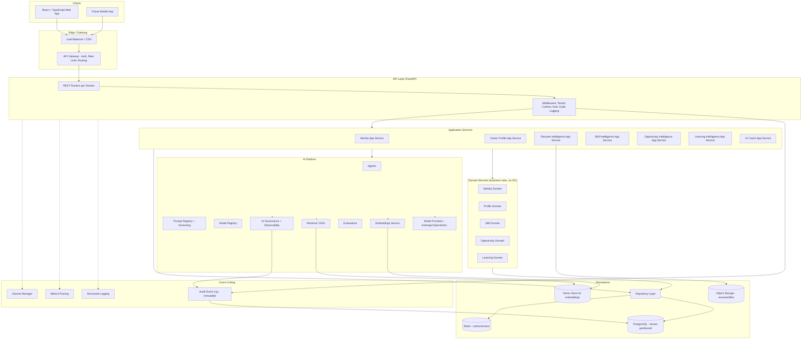

# Career Compass AI — Enterprise Architecture Proposal

**Status:** Draft for approval — no implementation code generated yet, per requested process.

---

## 1. Enterprise Architecture Diagram



**Layering rule:** API → Application Services → Domain Services → Repositories → Database. No layer calls upward; no UI/API talks to the database directly. AI Platform is treated as a peer capability invoked by Application Services, never called directly from the API layer.

---

## 2. Technology Decisions

| Concern | Decision | Rationale |
|---|---|---|
| Backend framework | **FastAPI** (Python 3.12 LTS-track, not 3.14 — avoids the bleeding-edge dependency breakage you hit with psycopg2 previously) | Native async, OpenAPI generation, Pydantic v2 for strong typing/validation, dependency-injection friendly |
| ORM | **SQLAlchemy 2.0** (async engine) + **Alembic** for migrations | Mature, explicit unit-of-work support, works cleanly with hexagonal repositories |
| DB driver | **psycopg 3** (async) | Avoids the binary-wheel issues you already hit once; psycopg3 has first-class asyncio support |
| Database | **PostgreSQL 16** | Row-level security (RLS) support is a strong fit for tenant isolation; JSONB for flexible AI metadata |
| Vector store | **pgvector extension** initially (same Postgres instance) | Keeps ops simple at launch; can graduate to a dedicated vector DB (e.g. Qdrant) later without changing the domain contracts |
| Cache/session | **Redis** | Token/session cache, rate-limiting counters, short-lived AI response cache |
| Object storage | **S3-compatible** (AWS S3 or MinIO for local dev) | Resume/file uploads kept out of the relational DB |
| Auth | **OAuth2/OIDC via FastAPI + `fastapi-users` or custom, backed by JWT access + refresh tokens** | Enterprise SSO/MFA readiness without locking into one IdP |
| AuthZ | **Custom RBAC/ABAC engine**, permissions stored in DB, not hard-coded | Matches your requirement for configurable permissions |
| Frontend | **React 18 + TypeScript + Vite** | Fast dev loop, strong typing parity with backend |
| Routing/state/data | **React Router**, **TanStack Query** (server state), **Zustand** (client state) | Clear separation of server cache vs UI state — avoids Redux boilerplate |
| Visualization | **Recharts** | Sufficient for dashboard-style charts, lightweight |
| AI model access | **Anthropic API as primary provider**, provider interface abstracted so OpenAI/others are swappable | Matches your existing Claude-centric workflow; abstraction protects against vendor lock-in |
| Containerization | **Docker**, **docker-compose** for local, **Kubernetes manifests** deferred to a later phase | You've had enough environment pain already — keep local dev simple first |
| CI/CD | **GitHub Actions** | Ubiquitous, integrates cleanly with the repo host |

---

## 3. Repository Structure

```
career-compass-ai/
├── backend/
│   ├── app/
│   │   ├── api/                     # FastAPI routers (thin, no business logic)
│   │   │   ├── v1/
│   │   │   │   ├── identity/
│   │   │   │   ├── career_profile/
│   │   │   │   ├── resume_intelligence/
│   │   │   │   ├── skill_intelligence/
│   │   │   │   ├── opportunity_intelligence/
│   │   │   │   ├── learning_intelligence/
│   │   │   │   └── ai_coach/
│   │   │   └── middleware/          # tenant context, auth, audit, error handling
│   │   ├── application/             # application services (orchestration, use cases)
│   │   │   ├── identity/
│   │   │   ├── career_profile/
│   │   │   ├── resume_intelligence/
│   │   │   ├── skill_intelligence/
│   │   │   ├── opportunity_intelligence/
│   │   │   ├── learning_intelligence/
│   │   │   └── ai_coach/
│   │   ├── domain/                  # pure business logic, no framework/db imports
│   │   │   ├── identity/
│   │   │   ├── career_profile/
│   │   │   ├── skill/
│   │   │   ├── opportunity/
│   │   │   └── learning/
│   │   ├── adapters/                # implementations of domain ports
│   │   │   ├── db/                  # SQLAlchemy repositories
│   │   │   ├── storage/             # S3/MinIO adapter
│   │   │   ├── cache/               # Redis adapter
│   │   │   └── ai_providers/        # Anthropic/OpenAI adapters
│   │   ├── ai_platform/
│   │   │   ├── agents/
│   │   │   ├── prompts/
│   │   │   ├── models/
│   │   │   ├── embeddings/
│   │   │   ├── retrieval/
│   │   │   ├── evaluations/
│   │   │   ├── governance/
│   │   │   └── providers/
│   │   ├── core/                    # config, security, logging, exceptions
│   │   └── main.py
│   ├── alembic/                     # migrations
│   ├── tests/
│   │   ├── unit/
│   │   ├── integration/
│   │   └── e2e/
│   ├── pyproject.toml
│   └── Dockerfile
├── frontend/
│   ├── src/
│   │   ├── components/              # shared design-system components
│   │   ├── features/                # one folder per business module (mirrors backend domains)
│   │   ├── routes/
│   │   ├── stores/                  # Zustand stores
│   │   ├── api/                     # generated client from OpenAPI + TanStack Query hooks
│   │   └── styles/
│   ├── package.json
│   └── Dockerfile
├── infra/
│   ├── docker-compose.yml
│   ├── github-actions/
│   └── k8s/ (future)
└── docs/
    ├── architecture/
    ├── adr/                         # architecture decision records
    └── runbooks/
```

Domain module folders (`career_profile`, `skill`, `opportunity`, `learning`, `identity`) are mirrored consistently across `api/`, `application/`, `domain/`, and `frontend/features/` so a developer can find "everything about skills" in the same relative location at every layer.

---

## 4. Domain Boundaries (Bounded Contexts)

| Bounded Context | Owns | Talks to | Does NOT own |
|---|---|---|---|
| **Identity** | Users, Organizations, Roles, Permissions, Tenants, Auth sessions | Everyone (via tokens/context) | Business/career data |
| **Career Profile** | Experience, Education, Certifications, Career goals | Identity (owner), Skill (references) | Skill scoring logic |
| **Resume Intelligence** | Resume documents, parsing, extraction results | Career Profile, Skill Intelligence | Long-term skill inventory (writes suggestions, doesn't own the record) |
| **Skill Intelligence** | Skill taxonomy, UserSkill, maturity levels, gap analysis | Career Profile, Opportunity, Learning | Resume parsing internals |
| **Opportunity Intelligence** | JobOpportunity, matching, career paths | Skill Intelligence (reads), Career Profile (reads) | Learning content |
| **Learning Intelligence** | LearningPath, Recommendation, progress tracking | Skill Intelligence (reads gaps) | Job matching logic |
| **AI Career Coach** | AIConversation, orchestration across other contexts | All others (read-mostly, via application services) | Source-of-truth business data — it composes, doesn't own |
| **AI Platform** (cross-cutting) | PromptVersion, ModelVersion, evaluations, governance | Every context that calls AI | Domain business rules |
| **Audit/Governance** (cross-cutting) | AuditEvent | Everyone (write-only append) | — |

Each context communicates through application-service interfaces, not direct domain-object sharing — e.g., Opportunity Intelligence asks Skill Intelligence for "current skill profile for user X," it never reaches into Skill's tables.

---

## 5. Database Design

Core entities (all include `id UUID`, `created_at`, `updated_at`; tenant-owned ones add `tenant_id`, `created_by`):

```
Tenant
  id, name, subdomain, plan_tier, status

Organization
  id, tenant_id, name, parent_org_id (nullable, for departments/teams)

User
  id, tenant_id, org_id, email, hashed_password, status, mfa_enabled

Role
  id, tenant_id (nullable for platform-level roles), name

Permission
  id, code, description

RolePermission
  role_id, permission_id

UserRole
  user_id, role_id, org_id (scoping)

CareerProfile
  id, tenant_id, user_id, headline, summary, career_readiness_score

Experience / Education / Certification
  id, tenant_id, career_profile_id, ...fields, date ranges

Skill
  id, name, category, taxonomy_source   -- global reference table, not tenant-owned

UserSkill
  id, tenant_id, user_id, skill_id, proficiency_level, evidence_source, last_assessed_at

CareerGoal
  id, tenant_id, user_id, target_role, target_date, status

Resume
  id, tenant_id, user_id, storage_key, parsed_status, parsed_at

JobOpportunity
  id, tenant_id (nullable if platform-wide catalog), title, org_id, required_skills (JSONB), status

LearningPath
  id, tenant_id (nullable if platform catalog), title, target_skill_ids (JSONB)

Recommendation
  id, tenant_id, user_id, type, payload (JSONB), status, generated_by ('ai'|'human')

AIConversation
  id, tenant_id, user_id, prompt_version_id, model_version_id, messages (JSONB), token_usage, feedback_score

PromptVersion
  id, name, version, template, owner, approved_by, approved_at, status

ModelVersion
  id, provider, model_name, version, status, cost_per_1k_tokens

AuditEvent
  id, tenant_id, user_id, action, resource_type, resource_id, timestamp, metadata (JSONB), ip_address
  -- append-only; enforced via DB trigger blocking UPDATE/DELETE

Subscription
  id, tenant_id, plan, status, renewed_at

FeatureFlag
  id, tenant_id (nullable = global default), key, enabled, config (JSONB)
```

**Tenant isolation strategy:** every tenant-owned table gets a `tenant_id` column, a non-nullable foreign key, and a **PostgreSQL Row-Level Security policy** (`USING (tenant_id = current_setting('app.tenant_id')::uuid)`), set per-connection by middleware at request start. This gives isolation enforced at the database layer, not just in application code — so a bug in a repository can't leak cross-tenant data. Global reference tables (`Skill`, platform-wide `JobOpportunity`/`LearningPath` catalogs) are the deliberate exceptions and are marked as such in the schema.

Indexing: composite indexes on `(tenant_id, <common filter column>)` for every tenant-owned table (e.g. `(tenant_id, user_id)` on `UserSkill`), plus GIN indexes on JSONB columns that get queried (`required_skills`, `payload`).

---

## 6. Security Architecture

- **Passwords:** Argon2id hashing, never bcrypt-only (Argon2 is the current OWASP recommendation).
- **Tokens:** Short-lived JWT access tokens (~15 min) + rotating refresh tokens stored server-side (Redis) so they can be revoked.
- **Transport:** TLS everywhere; HSTS; no plaintext internal traffic in production.
- **Input validation:** Pydantic models at the API boundary reject malformed input before it reaches application services.
- **File uploads (resumes):** virus scan on upload, strict content-type/magic-byte checks, storage outside the web root, signed short-lived URLs for retrieval, size limits.
- **Secrets:** environment-injected via a secrets manager (AWS Secrets Manager / Vault) — never committed, never in `.env` files that reach source control.
- **AuthZ enforcement:** checked at the application-service layer (not just the router), so internal callers can't bypass permission checks.
- **Common vulnerabilities:** parameterized queries only (SQLAlchemy handles this), CSRF protection for cookie-based flows, strict CORS allow-list per tenant subdomain, rate limiting per user/tenant/IP at the gateway.
- **Compliance readiness:** audit log immutability + data retention policy fields now, so SOC 2/ISO 27001 evidence-gathering later doesn't require a schema rewrite. GDPR: user data export and right-to-erasure are modeled as application-service operations from day one, even if not exposed in the UI initially.

---

## 7. Multi-Tenancy Approach

- **Isolation model:** shared database, shared schema, **row-level security** — the standard pragmatic middle ground between full physical isolation (expensive) and no isolation (unsafe). Chosen so a large enterprise tenant can later be moved to a dedicated schema or database without changing application code, since the repository layer already scopes every query by `tenant_id`.
- **Tenant resolution:** subdomain or auth-token claim → middleware sets `tenant_id` in request context → propagated to DB session (`SET LOCAL app.tenant_id`) and to the audit logger.
- **Tenant-specific configuration:** `FeatureFlag` and a `TenantConfig` JSONB blob hold per-tenant AI policy (e.g., which model tier is allowed, whether AI coaching is enabled, retention period).
- **Org hierarchy:** `Organization` self-references via `parent_org_id` to represent Org → Department → Team without new tables; `User.org_id` points to the most specific unit.

---

## 8. AI Governance Approach

- **Prompt lifecycle:** every prompt lives in `PromptVersion` with an explicit `status` (`draft → in_review → approved → deprecated`) and an `approved_by`. Application services reference prompts by version ID, never inline strings, so a change requires a new version row, not an in-place edit.
- **Model registry:** `ModelVersion` tracks provider, model name, cost, and status (`active`/`sunset`), so swapping or retiring a model is a config change, not a code change.
- **Observability:** every AI call logged as an `AIConversation` (or a lighter `AIInvocation` record for non-chat calls) capturing prompt version, model version, token usage, latency, and any user feedback signal — feeding the `evaluations` module.
- **Human review workflow:** recommendations generated by AI are stored with `generated_by='ai'` and a `status` (`pending_review`/`approved`/`rejected`) so tenants can require human sign-off on things like resume rewrites before they reach the end user, configurable per tenant via `FeatureFlag`.
- **Bias/quality evaluation:** the `evaluations` module runs offline batch checks against `AIConversation` samples (e.g., skill-recommendation consistency across demographic-neutral test profiles) — a scaffold from day one even if the first checks are basic.
- **Explainability:** recommendations store the input signals that drove them (e.g., "matched because skills X, Y align with 80% of role requirements") alongside the AI-generated text, so a coach or admin can see *why*, not just *what*.
- **Data privacy:** AI provider adapters strip or hash tenant-identifying fields before sending payloads to external model providers where feasible, and `TenantConfig` can restrict which provider/model a tenant's data is allowed to reach.

---

## 9. Implementation Roadmap

**Phase 0 — Foundations**
Repo scaffold, Docker Compose (Postgres + Redis + backend + frontend), core config/logging/exception handling, health checks, CI pipeline skeleton.

**Phase 1 — Identity & Multi-Tenancy**
Tenant/Organization/User/Role/Permission models + migrations, RLS policies, JWT auth, RBAC enforcement, audit event logging wired into middleware. This unblocks everything else.

**Phase 2 — Career Profile Core**
CareerProfile, Experience, Education, Certification, CareerGoal — full CRUD through all four layers, plus the corresponding React feature and dashboard shell.

**Phase 3 — Skill Intelligence**
Skill taxonomy, UserSkill, gap analysis logic (rule-based first, AI-assisted second).

**Phase 4 — AI Platform Scaffold**
`ai_platform/` module: provider adapter (Anthropic first), prompt registry, model registry, and the observability/logging hooks — built before any feature uses it, so every subsequent AI feature is governed from day one.

**Phase 5 — Resume Intelligence**
Upload → storage → parsing → skill-extraction pipeline, feeding Skill Intelligence.

**Phase 6 — Opportunity & Learning Intelligence**
Job matching, career path recommendations, learning path recommendations — these lean on Skill Intelligence and the AI Platform built in Phase 4.

**Phase 7 — AI Career Coach**
Conversational orchestration across all prior contexts; human-review workflow; evaluations module goes live.

**Phase 8 — Hardening & Ops**
Metrics/tracing, load testing, security review pass, Kubernetes manifests, subscription/feature-flag billing hooks.

Each phase, once approved, will be delivered with: files created, purpose, complete code, configuration, and testing instructions — per your requested process.

---

## Open Decisions for Your Sign-Off

1. **Identity provider:** build custom auth now, or start with a managed auth provider (e.g., Auth0/Clerk) and swap later?
2. **Vector store:** confirmed OK starting with pgvector-in-Postgres rather than a dedicated vector DB?
3. **Frontend design system:** build a lightweight custom component library now, or want me to spec out a specific design system (e.g., a Tailwind + shadcn/ui base) before Phase 2's dashboard work?

Let me know if this architecture looks right, and answers to the three questions above — then I'll start Phase 0.
