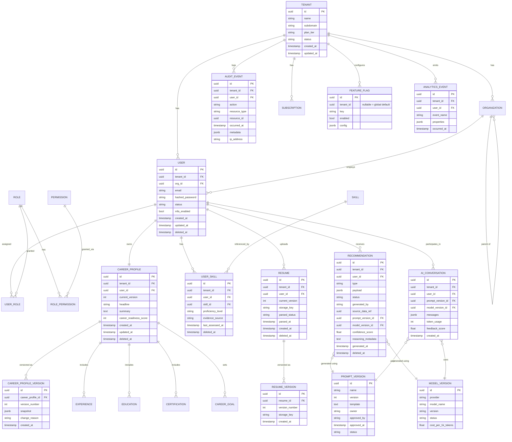
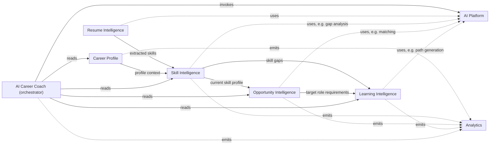
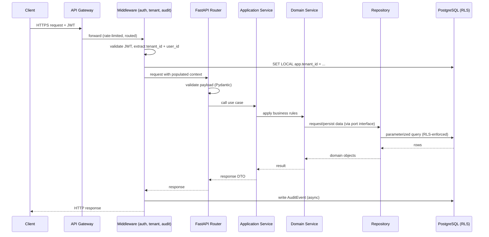
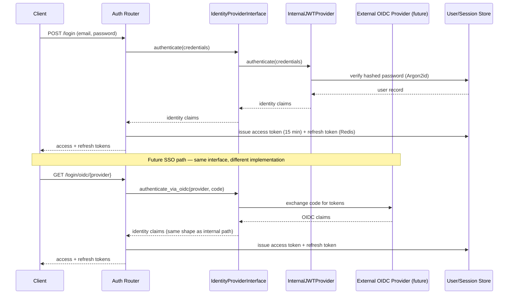
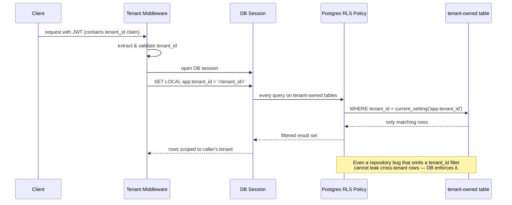
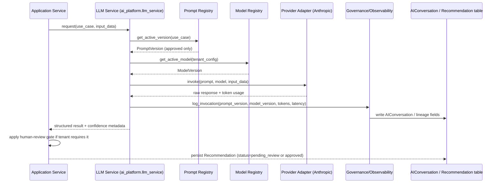

# Career Compass AI — Phase 0 Design Package

Incorporates all approved refinements: modular monolith, identity abstraction layer, tiered multi-tenancy, staged AI platform rollout, Tailwind/shadcn frontend, soft deletion, data lineage, versioning, and analytics foundation.

---

## 1. Final Repository Structure

```
career-compass-ai/
├── backend/
│   ├── app/
│   │   ├── api/                          # thin routers only
│   │   │   ├── v1/
│   │   │   │   ├── identity/
│   │   │   │   ├── career_profile/
│   │   │   │   ├── resume_intelligence/
│   │   │   │   ├── skill_intelligence/
│   │   │   │   ├── opportunity_intelligence/
│   │   │   │   ├── learning_intelligence/
│   │   │   │   ├── ai_coach/
│   │   │   │   └── analytics/
│   │   │   └── middleware/
│   │   │       ├── tenant_context.py
│   │   │       ├── auth.py
│   │   │       ├── audit.py
│   │   │       └── error_handling.py
│   │   ├── application/                  # use-case orchestration
│   │   │   ├── identity/
│   │   │   ├── career_profile/
│   │   │   ├── resume_intelligence/
│   │   │   ├── skill_intelligence/
│   │   │   ├── opportunity_intelligence/
│   │   │   ├── learning_intelligence/
│   │   │   ├── ai_coach/
│   │   │   └── analytics/
│   │   ├── domain/                       # pure logic, zero framework imports
│   │   │   ├── identity/
│   │   │   ├── career_profile/
│   │   │   ├── skill/
│   │   │   ├── opportunity/
│   │   │   └── learning/
│   │   ├── adapters/
│   │   │   ├── db/                       # SQLAlchemy repositories
│   │   │   ├── storage/                  # S3/MinIO
│   │   │   ├── cache/                    # Redis
│   │   │   ├── identity_providers/       # <-- NEW: internal + external IdP adapters
│   │   │   │   ├── internal_jwt.py
│   │   │   │   ├── oidc_base.py
│   │   │   │   ├── auth0.py              # stub, implemented when needed
│   │   │   │   ├── okta.py               # stub
│   │   │   │   └── azure_entra.py        # stub
│   │   │   └── ai_providers/
│   │   │       └── anthropic_provider.py
│   │   ├── ai_platform/
│   │   │   ├── llm_service/              # Phase 1: abstraction only
│   │   │   ├── prompts/
│   │   │   ├── models/
│   │   │   ├── embeddings/               # Phase 2: RAG
│   │   │   ├── retrieval/                # Phase 2: RAG
│   │   │   ├── agents/                   # Phase 3: orchestration (empty scaffold now)
│   │   │   ├── evaluations/
│   │   │   └── governance/
│   │   ├── core/
│   │   │   ├── config.py
│   │   │   ├── security.py               # password hashing, token utils
│   │   │   ├── identity_provider_interface.py   # <-- the abstraction contract
│   │   │   ├── logging.py
│   │   │   └── exceptions.py
│   │   └── main.py
│   ├── alembic/
│   ├── tests/
│   │   ├── unit/
│   │   ├── integration/
│   │   └── e2e/
│   ├── pyproject.toml
│   └── Dockerfile
├── frontend/
│   ├── src/
│   │   ├── components/                   # shadcn/ui-based primitives
│   │   ├── features/                     # mirrors backend domains
│   │   ├── routes/
│   │   ├── stores/
│   │   ├── api/                          # OpenAPI-generated client + TanStack Query hooks
│   │   └── styles/
│   │       └── tailwind.config.ts
│   ├── package.json
│   └── Dockerfile
├── infra/
│   ├── docker-compose.yml
│   ├── docker-compose.override.yml       # local dev overrides
│   ├── github-actions/
│   └── k8s/                              # deferred, placeholder only
└── docs/
    ├── architecture/
    ├── adr/
    └── runbooks/
```

Everything ships as **one deployable backend service** (modular monolith). Module folders under `api/`, `application/`, `domain/`, and `adapters/` are the seams along which a future service extraction would cut — no code changes to boundaries required later, just a deployment split.

---

## 2. Database ERD

Includes soft deletion (`deleted_at`), AI lineage fields, and versioning fields as requested.



**Soft deletion:** applied to every tenant-owned, user-facing entity (`User`, `CareerProfile`, `Resume`, `UserSkill`, `Recommendation`, etc.). Repositories filter `deleted_at IS NULL` by default; a separate admin-only query path can retrieve soft-deleted records for compliance/audit purposes. Reference/catalog tables (`Skill`, `PromptVersion`, `ModelVersion`) are not soft-deleted — they're versioned/deprecated instead.

**Versioning:** `CareerProfile` and `Resume` keep a `current_version` pointer on the parent row plus an append-only `*_VERSION` snapshot table, so history is queryable without complicating the "current state" read path. `Recommendation` doesn't need its own version table — each recommendation is already an immutable point-in-time record by design.

**AI lineage:** every `Recommendation` carries `source_data_ref` (what data triggered it), `prompt_version_id` + `model_version_id` (what generated it), `confidence_score`, and `reasoning_metadata` — enough to answer "why did the system suggest this" after the fact.

---

## 3. Domain Interaction Diagram



Solid arrows = synchronous read dependency (via application service calls, never direct table access). Dotted arrows = "uses as a capability" (AI Platform) or "emits an event to" (Analytics), which is fire-and-forget / async where possible.

---

## 4. Request Lifecycle Diagram



---

## 5. Authentication Flow

Shows internal JWT auth today, with the abstraction point where an external OIDC provider plugs in later without touching callers.



`IdentityProviderInterface` is the only thing `Application Services` and `API` routers depend on. `InternalJWTProvider` is the sole implementation in Phase 1; `Auth0`/`Okta`/`AzureEntra` adapters implement the same interface later, selected per-tenant via `TenantConfig`.

---

## 6. Tenant Isolation Flow



Enforced at two layers deliberately: application code always filters by `tenant_id` (defense in depth), and RLS policies make it structurally impossible to bypass even under a bug.

**Tier roadmap (unchanged from proposal, confirmed):**
- Tier 1 (default): shared DB + shared schema + RLS.
- Tier 2 (large enterprise tenant): same schema, dedicated database — a connection-string swap per tenant, no application code change since repositories already scope by `tenant_id`.
- Tier 3 (regulated customer): dedicated infrastructure — same container image, isolated deployment.

---

## 7. AI Request Lifecycle

Reflects the staged rollout: Phase 1 is LLM abstraction only, no agents yet.



Phase 2 (RAG) inserts an embeddings/retrieval step between `Prompt` and `Provider`. Phase 3 (agents) wraps this same lifecycle in a multi-step orchestration loop — the lifecycle itself doesn't change, agents just call it repeatedly with intermediate reasoning steps.

---

## 8. Local Development Setup Approach

```
infra/docker-compose.yml services:
  - postgres        (pgvector-enabled image, exposes 5432)
  - redis           (exposes 6379)
  - minio           (S3-compatible, local object storage, exposes 9000/9001)
  - backend         (FastAPI, hot-reload via uvicorn --reload, mounts ./backend)
  - frontend        (Vite dev server, hot-reload, mounts ./frontend)
```

**Setup steps:**
1. `cp .env.example .env` — fill in local secrets (never committed).
2. `docker compose -f infra/docker-compose.yml up -d postgres redis minio`
3. `cd backend && alembic upgrade head` — applies migrations, including RLS policy creation.
4. `docker compose -f infra/docker-compose.yml up backend frontend` (or run both natively with `uvicorn app.main:app --reload` / `npm run dev` for faster iteration).
5. Seed script (`backend/scripts/seed_dev_data.py`) creates a demo tenant, org, admin user, and reference `Skill` catalog so the frontend isn't empty on first run.
6. Backend docs available at `/docs` (FastAPI's auto-generated OpenAPI UI) — this is also the source for the frontend's generated API client.

No Kubernetes, no cloud dependency required for local dev — everything above runs on a laptop via Docker Compose, consistent with keeping Phase 0 operationally simple.

---

## Roadmap (confirmed, per your adjustment)

Phase 0 → Foundation · Phase 1 → Platform Foundation (tenant, identity abstraction, RBAC, audit, feature flags) · Phase 2 → Career Profile · Phase 3 → Skill Intelligence · Phase 4 → AI Platform Foundation · Phase 5 → Resume Intelligence · Phase 6 → Opportunity Intelligence · Phase 7 → Learning Intelligence · Phase 8 → AI Career Coach · Phase 9 → Analytics, Billing, Enterprise Features.

---

Ready to begin Phase 0 implementation on your confirmation.
