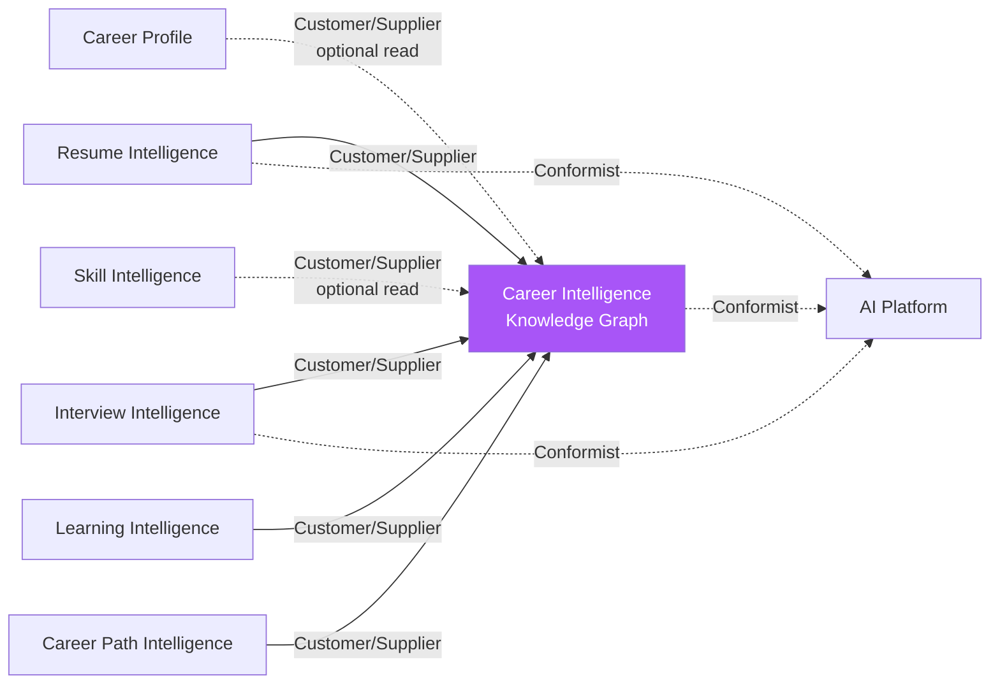

# Career Intelligence Knowledge Graph — Domain-Driven Design

Foundational document 2 of 3. See `cikg-overview.md` for domain
decomposition context and `ADR-006` for the decision this implements.

## A Real Tension, Named Up Front

Classic DDD aggregates exist to enforce **transactional consistency
boundaries** — an aggregate root is the one thing you load, mutate, and
save atomically, and nothing outside it is guaranteed consistent in the
same transaction. A **knowledge graph's entire value** is the opposite
shape: cross-cutting, many-to-many relationships queried broadly (`find
all skills related to Product Strategy`), not a tight consistency
boundary around one entity.

Forcing CIKG into large, deeply-nested DDD aggregates (e.g. a `Role`
aggregate that embeds its full skill list, competency list, and
technology list as owned child collections) would fight the graph
requirement directly — every relationship becomes something only
reachable by first loading its "owning" aggregate, which is exactly
what a graph is supposed to avoid, and exactly what would make a future
Neo4j migration hard instead of straightforward.

**Resolution:** CIKG's aggregates are deliberately **thin — one entity,
its own scalar attributes, nothing else.** Relationships are never
embedded; they're separate edge records, referenced by ID in both
directions, each independently queryable and independently
write-transactional. This is not a weaker application of DDD — it's the
correct application of it for a domain whose core requirement is graph
traversal, not aggregate-scoped invariants. The few real invariants
that *do* need transactional enforcement (below) still get proper
aggregate treatment; they're just narrower than "the whole graph
neighborhood."

## Bounded Contexts

| Bounded Context | Responsibility | Relationship to others |
|---|---|---|
| **Career Intelligence Knowledge Graph** (new) | Canonical reference data: Skill, Competency, Role, Industry, Technology, Certification, Company, Career Path, and their relationships | Upstream of every domain below; owns no tenant/user data |
| **Career Profile** (existing) | A person's own experience, education, goals | Unrelated to CIKG's internals; may optionally reference `Skill` ids via the alias/matching layer (ADR-006 §3) |
| **Skill Intelligence** (existing, ADR-005) | Free-text skill lists + gap-analysis computation | Same relationship as Career Profile — optional soft reference, never owns or is owned by CIKG entities |
| **Resume Intelligence** (future) | Generating/tailoring resumes, ATS scoring | Reads `Skill`, `Role`, `Technology` from CIKG to ground bullet generation and ATS keyword matching; owns its own `Resume`/`ResumeBullet` entities |
| **Interview Intelligence** (future) | Interview prep | Reference half (`InterviewQuestion` bank) lives in CIKG; personal half (a user's prep sessions, saved STAR stories) is tenant-owned and references CIKG questions/skills by id |
| **Learning Intelligence** (future) | Learning recommendations | Reference half (`LearningResource` catalog) lives in CIKG; personal half (enrollment, progress) is tenant-owned |
| **Career Path Intelligence** (future) | Role-to-role progression modeling | `CareerPath` graph lives in CIKG (it's reference data — "Scrum Master → RTE → Enterprise Coach" is true independent of any one user); a user's own target/current position is tenant-owned, already partially covered by the existing `TargetRole`/`CareerGoal` entities |
| **AI Platform** (existing, cross-cutting) | Provider abstraction, prompt/model registries, governance | CIKG is a new *consumer* of this (RAG grounding, agent tool interfaces) — no changes to AI Platform's own bounded context |

Every future bounded context follows the existing layering convention
(`docs/architecture/backend-architecture.md`): API routers → Application
services → Domain services (framework-free) → Repository interfaces →
Adapters. CIKG is no exception — `app/domain/career_intelligence/`
holds plain dataclasses and Protocol repository interfaces, same as
every other domain.

## Aggregates Within CIKG

Each is its own aggregate root — independently created, updated,
versioned, and deleted, never cascade-loaded as part of another:

| Aggregate Root | Owns (as its own scalar/structured attributes) | Explicitly NOT owned (separate edge records instead) |
|---|---|---|
| `Skill` | id, name, category, subcategory, description, aliases, ATS keywords, proficiency-level definitions, behavioral indicators, measurable-outcome templates | Related skills, prerequisite skills, associated roles/certifications/technologies/industries — all edges |
| `Competency` | id, name, description | Member skills — edges (`competency_skill`) |
| `Role` | id, title, description, experience-level expectations | Required/preferred skills, competencies, technologies, certifications, industries, progression paths — all edges |
| `Industry` | id, name, description | Emphasized skills — edges |
| `Technology` | id, name, vendor, category | Supported skills — edges |
| `Certification` | id, name, provider, level, renewal period, prerequisites (as a scalar list of other certification ids — a genuine ordering/precondition attribute of the certification itself, not a graph traversal) | Validated skills — edges |
| `Company` | id, name, industry (single FK, not an edge — a company has exactly one primary industry classification), culture notes, tech stack, interview-pattern notes | Preferred/valued skills, competency preferences — edges |
| `CareerPath` | id, name, ordered role sequence (a scalar attribute — the sequence *is* the entity's reason to exist) | — |
| `InterviewQuestion` | id, question text, ideal-answer template, difficulty, behavior indicators | Skill(s) tested, associated role/company — edges |
| `LearningResource` | id, title, type (book/course/video/project/mentor), provider, url | Skill(s) taught, prerequisite resources — edges |

**Genuine transactional invariants** (the narrow cases where an
aggregate boundary matters, not just "this entity has relationships"):
- A `Skill` cannot be deleted while any edge references it — enforced
  at the repository layer via a reference count check, same pattern as
  existing soft-delete guards elsewhere in the codebase, not a
  cross-aggregate transaction.
- A `CareerPath`'s role sequence must reference existing `Role` ids in
  order — validated at write time within `CareerPath`'s own aggregate,
  since the sequence is `CareerPath`'s own attribute, not a traversal.

## Edge Records Are Their Own First-Class Rows

Every relationship (`Role requires Skill`, `Certification validates
Skill`, etc.) is a separate table row with its own id, not a join-table
row that exists only implicitly. This matters for two reasons:

1. **Relationships carry their own metadata** — e.g. `Role requires
   Skill` needs a `requirement_level` (required vs. preferred), and
   `Certification validates Skill` might carry a `weight`. A bare
   many-to-many join table can't hold that without becoming a
   first-class entity anyway — so it starts as one.
2. **This is precisely what makes the Postgres-now/Neo4j-later path
   straightforward** (detailed in `cikg-knowledge-graph-model.md`): an
   edge table with `(id, source_id, target_id, relationship_type,
   metadata...)` *is* a relational encoding of a graph edge, not an
   approximation of one.

## Context Map

CIKG is the **Supplier** in every relationship — it never depends on
any tenant-owned domain (no imports, no foreign keys pointing outward).
This one-directional dependency is what keeps it safely additive: CIKG
can be built, populated, and even deleted entirely without any other
domain's data model changing, because nothing points *into* it from the
outside except by choice (the optional alias/matching layer).

## Related Documents

- `docs/adr/ADR-006-career-intelligence-knowledge-graph.md`
- `docs/architecture/cikg-overview.md`
- `docs/architecture/cikg-knowledge-graph-model.md`
- `docs/architecture/backend-architecture.md` — the layering convention every bounded context follows
