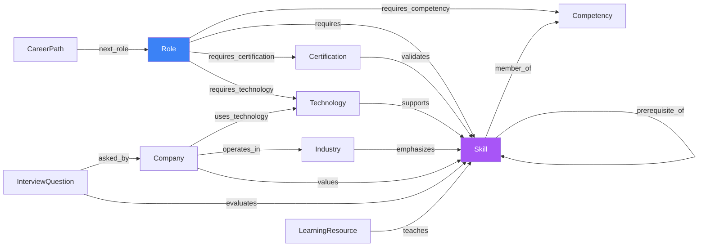

# Career Intelligence Knowledge Graph — Conceptual Model

Foundational document 3 of 3. See `cikg-ddd.md` for aggregate
boundaries and `cikg-overview.md` for how this fits the wider system.
The logical ERD and physical PostgreSQL schema (with exact column
types, indexes, and migration plan) are second-pass deliverables that
implement what's modeled conceptually here.

## Node Types

| Node | Description | Aggregate root? |
|---|---|---|
| `Skill` | A discrete, nameable capability (e.g. "Lean Portfolio Management", "Python", "Executive Coaching") | Yes |
| `Competency` | A named grouping of related skills (e.g. "Leadership" groups Coaching, Mentoring, Influence) | Yes |
| `Role` | A job role/title (e.g. "Enterprise Agile Coach") | Yes |
| `Industry` | A sector (e.g. "Healthcare", "Banking") | Yes |
| `Technology` | A tool/platform/language (e.g. "Azure DevOps", "Python", "Kubernetes") | Yes |
| `Certification` | A credential (e.g. "Advanced SAFe Practice Consultant") | Yes |
| `Company` | An organization profile (culture, tech stack, interview patterns) | Yes |
| `CareerPath` | An ordered role progression (e.g. Scrum Master → RTE → Enterprise Coach) | Yes |
| `InterviewQuestion` | A reference interview question with an ideal-answer template | Yes |
| `LearningResource` | A book/course/video/project/mentor/assessment | Yes |

Note: `Technology` (e.g. "Python") and `Skill` (e.g. "Python
Programming") are intentionally separate node types even when the name
looks similar, per the source spec's explicit instruction ("separate
technologies from skills... these should reference skills rather than
duplicate them"). A `Technology` node never restates a skill's
description/ATS-keywords/proficiency-levels — it links to the `Skill`
node that already owns that content via a `supports` edge.

## Edge Types

| Edge | From → To | Cardinality | Carries |
|---|---|---|---|
| `requires` | Role → Skill | many-to-many | `requirement_level` (required / preferred) |
| `requires_competency` | Role → Competency | many-to-many | `requirement_level` |
| `related_to` | Skill → Skill | many-to-many, symmetric | `strength` (weak / moderate / strong) |
| `prerequisite_of` | Skill → Skill | many-to-many, directed | — |
| `member_of` | Skill → Competency | many-to-many | — |
| `validates` | Certification → Skill | many-to-many | `weight` |
| `supports` | Technology → Skill | many-to-many | — |
| `emphasizes` | Industry → Skill | many-to-many | `emphasis_level` |
| `values` | Company → Skill | many-to-many | `notes` |
| `uses_technology` | Company → Technology | many-to-many | — |
| `operates_in` | Company → Industry | many-to-one | — |
| `evaluates` | InterviewQuestion → Skill | many-to-many | — |
| `asked_by` | InterviewQuestion → Company | many-to-many | — |
| `teaches` | LearningResource → Skill | many-to-many | — |
| `requires_technology` | Role → Technology | many-to-many | — |
| `requires_certification` | Role → Certification | many-to-many | `requirement_level` |
| `next_role` | CareerPath → Role (ordered) | many-to-many, ordered | `sequence_position` |
| `demonstrates`* | ResumeBullet → Skill | many-to-many | — |

`*` = defined here for completeness per the source spec (`Resume Bullet
demonstrates Skill`) but `ResumeBullet` itself belongs to the future
Resume Intelligence bounded context, not CIKG — CIKG only defines the
edge *type* that domain will use to point at CIKG's `Skill` nodes.

## Conceptual Graph Diagram



## Modeling It Relationally Now, Graph-Ready Later

Every edge type above maps to its own PostgreSQL table with the same
shape:

```
<edge_name> (
    id UUID PRIMARY KEY,
    source_id UUID NOT NULL REFERENCES <source_node_table>(id),
    target_id UUID NOT NULL REFERENCES <target_node_table>(id),
    -- edge-specific metadata columns (requirement_level, weight, etc.)
    created_at TIMESTAMPTZ NOT NULL DEFAULT now(),
    source_attribution TEXT  -- who/what asserted this edge: curator id, AI pipeline run id, import batch id
)
```

This is deliberately a relational encoding of a **property graph**
(nodes with properties + directed, typed, property-bearing edges) —
not a generic `entity_a / relationship_type / entity_b` triple store.
Per-edge-type tables (rather than one polymorphic `edges` table) are
chosen specifically because:

- Each edge type's metadata is genuinely different (`requirement_level`
  vs. `weight` vs. `emphasis_level`) — a single polymorphic table would
  need a JSONB metadata blob, losing referential integrity and query
  performance on that metadata.
- Postgres foreign keys stay real (`source_id`/`target_id` reference
  concrete tables), so referential integrity is enforced by the
  database, not application code.
- A future migration to Neo4j (or another property graph store) is then
  a mechanical, near-1:1 export: each node table → a node label with
  the same properties; each edge table → a relationship type with the
  same properties, `source_id`/`target_id` becoming the relationship's
  endpoints. No re-modeling — the conceptual model above already *is*
  the target graph model, just stored relationally today. This directly
  satisfies the spec's "future migration to Neo4j... should be
  straightforward" requirement.

## Connecting CIKG to Existing Personal Data (ADR-006 §3)

The mechanism that keeps CIKG optional and non-blocking:

```
skill_alias (
    id UUID PRIMARY KEY,
    skill_id UUID NOT NULL REFERENCES skill(id),
    alias_text TEXT NOT NULL,       -- normalized free-text form, e.g. "python", "python programming"
    source TEXT NOT NULL,           -- 'curated' | 'ai_suggested' | 'user_confirmed'
    confidence NUMERIC              -- for ai_suggested rows
)
```

`CareerProfile.core_competencies` and `TargetRole.required_skills`
remain plain `list[str]` columns — **no schema change to either**. A
separate, read-only *resolution service* (part of CIKG's application
layer, not Career Profile's) can look up `skill_alias` for a given
free-text string and return a matching `Skill` id if one exists, used
by:
- Search/gap-analysis features that want to enrich a free-text list
  with graph relationships (e.g. "skills related to what you already
  listed") wherever a match is found, degrading gracefully to "no
  suggestion" wherever it isn't.
- AI grounding (RAG) — resolving a person's free-text skills to graph
  nodes before retrieving related context, without ever requiring that
  resolution to succeed for the rest of the request to proceed.

This table can be empty at launch and grow entirely through usage (a
"did you mean this canonical skill?" suggestion the user can confirm,
recorded as a `user_confirmed` alias) — it does not need to be
pre-populated for CIKG to be built and deployed safely.

## Search Surface (conceptual only — full strategy is a second-pass deliverable)

The spec's example queries map directly onto this model without new
concepts:

- *"Find all skills related to Product Strategy"* → traverse `related_to`
  from the `Skill` node matching "Product Strategy".
- *"Find certifications validating Lean Portfolio Management"* → reverse
  traverse `validates` into the matching `Skill`.
- *"Find roles requiring Azure DevOps"* → `Technology` "Azure DevOps" →
  `supports` → `Skill` set → reverse `requires` from `Role`.
- *"Find interview questions for Executive Coaching"* → `Skill`
  "Executive Coaching" → reverse `evaluates` from `InterviewQuestion`.
- *"Find all resume bullets demonstrating Flow Metrics"* → `Skill` "Flow
  Metrics" → reverse `demonstrates` from `ResumeBullet` (once Resume
  Intelligence exists).

Whether these are served via recursive CTEs / joins in Postgres, a
dedicated graph query layer, pgvector-backed semantic search, or a
combination is the subject of the Search & Indexing Strategy document
(second pass) — the point here is that the conceptual model doesn't
need to change to support any of those implementation choices.

## Related Documents

- `docs/adr/ADR-006-career-intelligence-knowledge-graph.md`
- `docs/architecture/cikg-overview.md`
- `docs/architecture/cikg-ddd.md`
