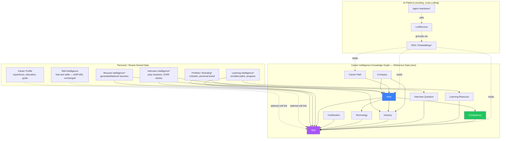

# Career Intelligence Knowledge Graph (CIKG) — High-Level Solution Architecture

Foundational document 1 of 3 (see also `cikg-ddd.md`,
`cikg-knowledge-graph-model.md`, and `docs/adr/ADR-006-career-intelligence-knowledge-graph.md`
for the decision this is built on). Detailed ERD, physical schema, API
spec, search/indexing, AI/RAG architecture, security detail,
extensibility strategy, and implementation roadmap follow in a second
pass once this foundational set is reviewed.

## Scope Recap

Career Compass AI is not a resume builder — it's a career-intelligence
platform spanning resume generation/tailoring/ATS optimization, career
planning, interview prep, skill-gap analysis, learning recommendations,
career-path planning, certification planning, AI coaching, portfolio
management, personal branding, and executive coaching, for any
profession, industry, and career stage, without schema changes per new
domain added.

## Where CIKG Sits

Career Compass AI is already a modular monolith (ADR-001): one
deployable service, strict layering per module
(`docs/architecture/backend-architecture.md`), module boundaries drawn
so an eventual service extraction is a deployment change, not a
rewrite. CIKG doesn't change that architectural style — it adds new
modules inside it, plus one cross-cutting reference-data layer every
career-related module can read from.

`*` = not yet built; named here only to show where the spec's future
domains attach to the same reference graph, per ADR-006's "consume, don't
own" pattern.

## Domain Decomposition

| Domain | Kind | Status | Owns |
|---|---|---|---|
| Identity | Tenant-owned | Built | Tenants, orgs, users, roles, permissions |
| Career Profile | Tenant-owned | Built | Experience, education, certifications (personal), goals |
| Skill Intelligence | Tenant-owned | Built (ADR-005) | Free-text skill lists, gap analysis computation |
| **Career Intelligence Knowledge Graph** | **Reference (new)** | **Proposed** | Skill, Competency, Role, Industry, Technology, Certification, Company, Career Path graph |
| Resume Intelligence | Tenant-owned, reads CIKG | Not started | Generated/tailored resumes, ATS scoring |
| Interview Intelligence | Tenant-owned, reads CIKG | Not started | Interview questions (reference) + prep sessions (personal) |
| Learning Intelligence | Tenant-owned, reads CIKG | Not started | Learning resources (reference) + enrollment/progress (personal) |
| Portfolio / Branding | Tenant-owned, reads CIKG | Not started | Portfolio items, LinkedIn/brand content |
| AI Career Coach | Tenant-owned, reads CIKG | Built (chat only so far) | Conversational orchestration |
| AI Platform | Cross-cutting | Built | Provider abstraction, prompt/model registries, governance; RAG/agents extend this |
| Analytics | Cross-cutting | Not started | Engagement/adoption tracking |
| Audit | Cross-cutting | Built | Immutable action log |

Interview Intelligence and Learning Intelligence each split into a
reference half (question bank / resource catalog — CIKG-adjacent, same
"reference data" treatment) and a personal half (a user's own prep
sessions, enrollments, progress — tenant-owned, same shape as Career
Profile). This split is what keeps every future domain following the
same pattern instead of inventing a new one per feature.

## Why This Doesn't Require Schema Redesign Per New Profession/Industry

Every entity in CIKG is *data*, not *schema*. Adding "Healthcare" or
"Construction" as an industry, or "Enterprise Agile Coach" as a role, is
an `INSERT`, not a `CREATE TABLE`/migration. The schema defines entity
*types* and relationship *types* (Role requires Skill, Skill related-to
Skill, Certification validates Skill); which specific skills, roles,
and industries exist is content, populated by curation and/or an AI
content pipeline (see the roadmap document for the content-ops
strategy). This is the same principle already proven in this codebase
by `permissions`/`roles` and `PromptVersion`/`ModelVersion` — reference
tables whose *rows* grow, not their *columns*.

## Non-Functional Alignment

| Requirement (from spec) | How this architecture addresses it |
|---|---|
| Profession-agnostic | Entity types are generic (Skill, Role, Industry); no profession-specific columns/tables |
| Modular | New bounded contexts per capability, same layering as existing modules |
| Graph-oriented | Relational-now/graph-ready modeling — see `cikg-knowledge-graph-model.md` |
| AI-native | CIKG is the grounding substrate for RAG; existing `LLMService`/governance model extends, doesn't get replaced |
| Extensible | New node/edge *types* require migrations (rare); new node/edge *instances* never do |
| Multi-tenant capable | CIKG itself is tenant-agnostic reference data; every consuming domain remains tenant-scoped via existing RLS |
| Secure | No new trust boundary — CIKG is read-heavy reference data behind the same auth every other endpoint requires; write access is a curator/admin permission, detailed in the security document (second pass) |

## Related Documents

- `docs/adr/ADR-006-career-intelligence-knowledge-graph.md` — the decision this is built on
- `docs/architecture/cikg-ddd.md` — bounded contexts and aggregates
- `docs/architecture/cikg-knowledge-graph-model.md` — entities, relationships, Postgres-to-graph mapping
- `docs/adr/ADR-005-skill-intelligence-simplification.md` — why the personal skill list stays free-text
- `docs/architecture/system-overview.md`, `docs/architecture/multi-tenancy-design.md` — existing platform architecture this extends
